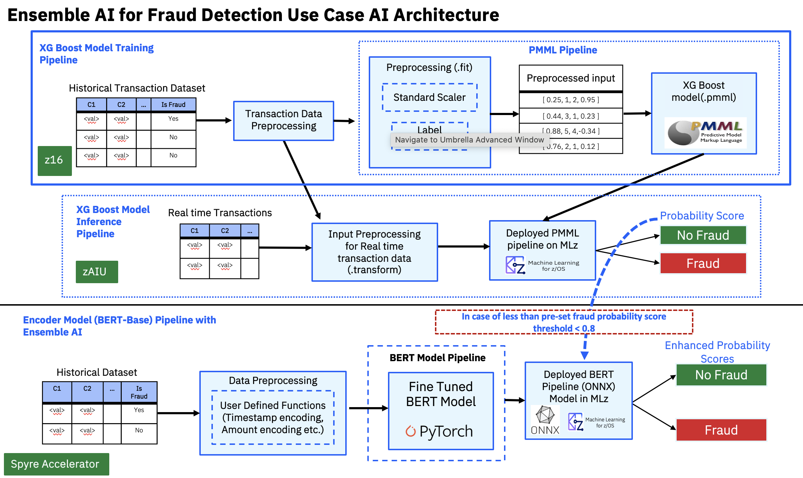

## Overview
Here's an end-to-end training/inference pipeline designed for credit card fraud detection as an ensemble usecase. 

## Build an end-to-end training pipeline 

Follow the following steps to build an end-end training pipeline for XGBoost and BERT

**Step - 1 :** Training the XGBoost Model 
- Run the XGBoost_training.ipynb notebook to train the xgb model on CCF dataset. It generates the xgb trained model(.pmml) which can further be used for inferencing.

**Step - 2 :** Training the BERT model
- Run the Bert_training.ipynb notebook to train the encoder model on CCF dataset. The data preprocessing functions required are provided in the user defined data package. 
- Upon training the model, it generates a checkpoint which can be converted to onnx format and can be used for inferencing.

## Inferencing 

- infer_onnx.py file is used for local inferencing of bert model for testing.
- Run the ensemble_inference_MLz.ipynb to do the ensemble inferencing.
